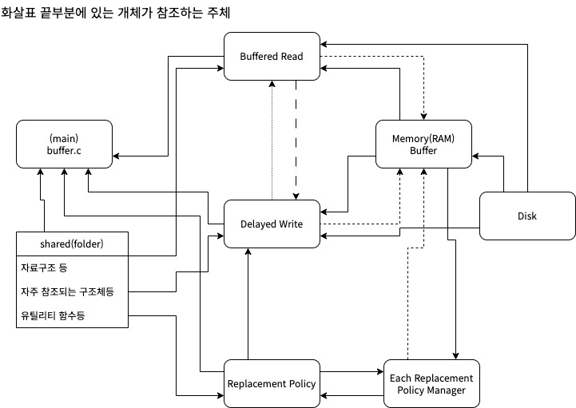

# BufferCacheProject
---
* 코드 패턴은 가급적이면 MVC 나 MVP패턴을 유지시키면서 작성하는 것이 좋음
    - 패턴 설명: https://beomy.tistory.com/43
* Git 업로드 및 브랜치 규칙은 가급적이면
  *  각 폴더를 개발할때는 [Trunk Based Development](https://helloinyong.tistory.com/335) 를 사용하도록 하고
  *  buffer.c 를 직접적으로 수정 및 추가할 때는 [Git-flow](https://techblog.woowahan.com/2553/) 를 사용해서 작성하는 것을 권고
* 각 폴더를 개발할때는 가급적이면 이해하기 쉽게 전역 변수 선언이나 함수선언시,어떤 기능을 하기 위한 함수인지 선언 위쪽에 간략하게 **주석을 달아주기를 권고**
* 폴더 설명
  
  | 폴더 | 설명 |  비고 |  
  |---|---|---|  
  |delayed_write| delayed_write 맡은 팀원이 코드 작성 및 관리 | |  
  |buffered_read| buffered_read 맡은 팀원이 코드 작성 및 관리 | |  
  |replacement_policy| replacement_policy 맡은 팀원이 코드 작성 및 관리| |  
  |shared| 각 폴더나 각 맡은 분야에서 서로 참조하는 변수나 함수를 작성 관리 | 예)메모리버퍼변수|
  |external_tools| 디스크 파일 생성등 프로젝트에 필요한 도구들이 모여있음 | 개별 빌드 및 실행|

* 각 폴더에 있는 "export_api.h"
  - 코드 작성 완료 뒤, buffer.c(메인 코드) 함수에서 작성한 함수나 변수가 노출(public)되어 질 수 있도록 헤더를 기술
* "shared/common_shared.h"
  - 꽤나 높은 빈도수로 여러 분야에서 참조될 것 같은 공용 함수 및 변수를 기술
* "external_tools/create_empty_disk_file.c"
  -  dd명령어를 사용해 변수 *n* 에 따른 다른 크기의 디스크 파일 생성

* Makefile
  * 폴더로 나누어 놔서, 빌드하기 쉽게 Makefile로 작성
  * ~~하위 폴더에서 서브 Makefile을 만들어 따로 관리해도 괜찮으나,구현시 최상단 Makefile코드에 에러 없고 업데이트가 가능하게 끔 서브 빌드를 구현같이 구현바람~~
  * 상위 Makefile에서 터미널상에서 정상인데 object파일 생성이 안되는 이슈때문에 각 폴더에서 Makefile을 관리하는 방식으로 변경(추가/변경이 필요한 경우 각자 관리 및 수정바람)
  * 빌드 명령어
    ``` shell
        make
        #혹은
        make buffer_cache
    ``` 
  * clean 명령어
      ``` shell
          make clean
          #혹은
          make clean-all
      ``` 

폴더및 업무별 간략 참조관계
---



기능구현 상황
---
* Buffered Read 영역
  * [x] OS 레이어(os_read, os_write 함수)에 버퍼 기능을 구현한다.  
  * [x] 버퍼는 메모리를 사용하며, 총 N개를 관리할 수 있도록 한다.  
  * [x] 버퍼 각각은 하나의 블록 내용을 저장(4KB)할 수 있으며, 데이터 저장 공간과 메타데이터 (블록 번호, 빠른 탐색을 위한 데이터) 저장 공간으로 구성된다.  
  * [x] 빠른 탐색을 위한 데이터 구조 (e.g., hash)는 자유롭게 정한다.  
  * [x] 읽기 요청 블록이 Buffer에 없다면 Disk에서 Buffer로 읽은 후, Buffer의 내용을 상위 레이어에 전달한다. 요청한 블록이 Buffer에 있다면 파일에서 읽지 않고 Buffer의 내용을 전달한다.
  * [x] (버퍼읽는 알고리즘의 성능을 평가함)자료구조 및 탐색구조 최적화
  * [ ] hit , miss에 관한 경과시간 그래프 데이터 산출
* Delayed Write 영역
  * [x] 응용이 Write한 내용을 Buffer에 기록하고 리턴한다.
  * [x] 모든 Buffer가 사용 중인 경우, Victim을 선정하여 Buffer에서 방출시킨 후, 빈 Buffer를 만들어 기록한다.
  * [x] Dirty 상태의 Buffer가 Victim으로 선정된 경우, Disk에 내용을 쓴 후, 회수할 수 있다.
  * [x] Buffer에 Write된 내용이 Disk에 쓰여지지 않았다면 Dirty 상태로 표시한다.
  * [x] Dirty Buffer를 Disk에 Write하는 기능을 Thread (flush thread)를 이용하여 해볼 것
  * [x] Buffer가 flush thread에 의해 Disk에 Write 중인 경우, 응용이 overwrite하지 못하도록 동기화 (locking) 메커니즘을 사용할 것
  * [x] (버퍼쓰는 알고리즘의 성능을 평가함)빠른 write 알고리즘 구현 및 최적화
  * [x] 이전 버퍼값을 write후 새 버퍼 값을 쓰도록 알고리즘 세부 구현
 
* Replacement Policy 영역
  * [x] Buffer 부족 시(read/write시 둘다 포함), Victim을 선정하는 FIFO, LRU, LFU 등 널리 알려진 알고리즘을 3개 이상 구현한다.
  * [x] Normal distribution 또는 Zipfian Distribution을 따르는 Block Access Sequence를 생성하고, 구현한 Replacement Policy에서 Hit가 얼마나 발생하는 지 테스트해 본다. 여기서 Block Access Sequence는 Block Read만 포함하도록 한다.
  * [x] 방출할 버퍼 디스크 상태 최신으로 동기화 요청 구현
  * [ ] replacement policy 잘 동작하는지 보여주도록 데이터 산출및 시각화 구현


기타 참조 링크
---
* https://github.com/melody1214/Trapfetch
* https://github.com/torvalds/linux/blob/master/mm/mmap.c